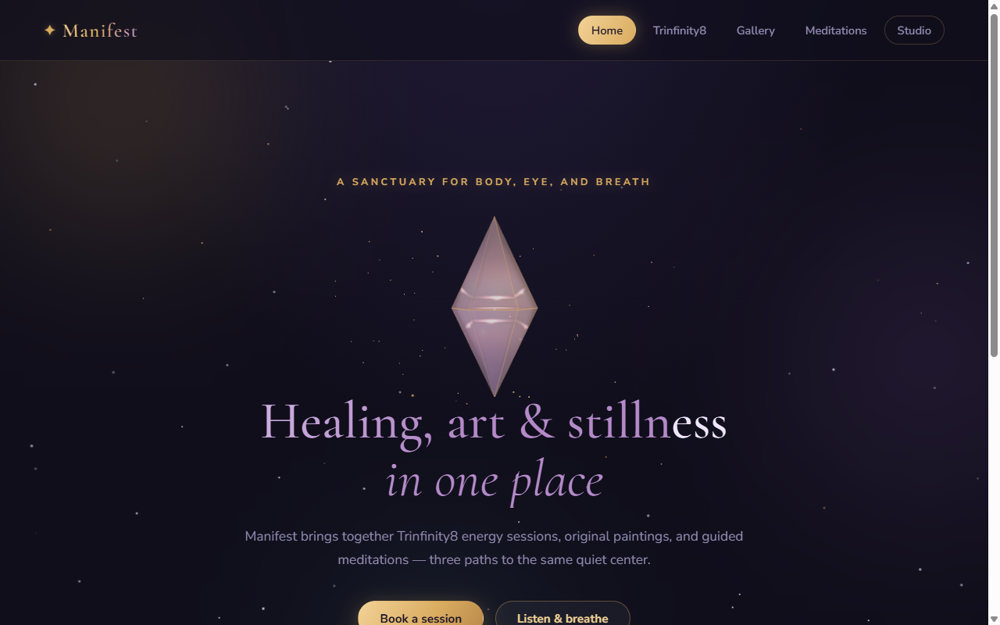
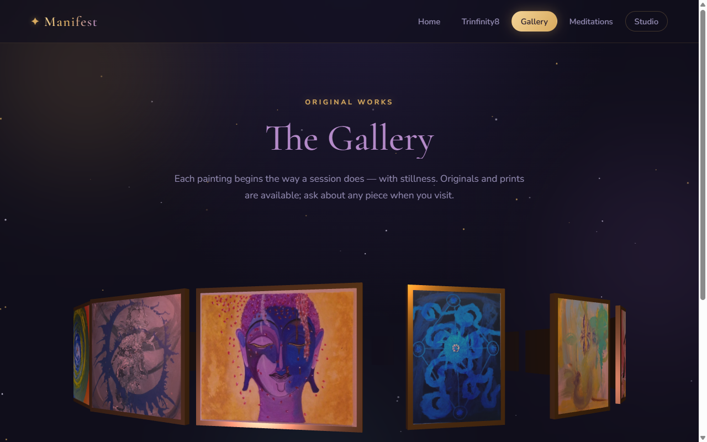

<div align="center">

# ✦ Manifest

### Healing · Art · Stillness — in one place

**A full-3D wellness studio web app for [11 Hearts Frequency](https://11heartsfrequency.org)**

[](https://app.11heartsfrequency.org)
[](https://www.python.org)
[](https://threejs.org)
[](https://www.paypal.com)

<br>



</div>

---

## What it is

Manifest is the client-facing home of a wellness practice built around three offerings:

| | |
|---|---|
| 🔮 **Trinfinity8 sessions** | Session offerings with prices, in-person & remote options, and a booking form that opens straight into checkout |
| 🖼 **The Gallery** | 21 original paintings hung in gold frames on a **rotating 3D ring** — drag to spin it, click a painting for a cinematic close-up with a sweeping light |
| ☾ **Guided meditations** | Streaming audio tracks with optional paid downloads (free/paid mix, gated automatically) |

Plus a PIN-protected **Studio** for the practitioner: booking requests with a status workflow, payments received, a session timer, and a session journal.

<div align="center">

</div>

## The experience

- **Celestial design** — a living night sky with ~90 twinkling stars (canvas), three drifting aura orbs that lean toward the cursor, glassmorphism panels, and a shimmering gradient headline
- **A 3D quartz crystal** greets visitors on the home page — translucent, glowing from within, circled by sparkles, tilting toward the mouse (a nod to Trinfinity8's crystal transmitter rods)
- **Micro-interactions everywhere** — scroll-triggered reveals, 3D card tilt, cursor aura, light-sweep buttons
- **Accessible by design** — `prefers-reduced-motion` gets a calm still version; touch devices skip pointer effects; if WebGL is unavailable the gallery falls back to an elegant 2D masonry grid; software-rendered GPUs get a lighter scene automatically

## Under the hood

```
server.py            ← the whole backend: Python 3 standard library only, zero dependencies
public/
  index.html         ← single-page app (5 views, no framework)
  style.css          ← celestial theme
  app.js             ← views, booking, checkout, studio, interaction layer
  crystal.js         ← hero crystal (Three.js module)
  gallery3d.js       ← rotating gallery ring + cinematic painting viewer
  vendor/three.module.min.js
paintings/           ← drop images in → they appear in the gallery, titled from filenames
meditations/         ← drop audio in → playable tracks (price them in payment-config.json)
data/                ← bookings, orders, session journal (JSON, git-ignored)
payment-config.json  ← prices + Stripe/PayPal keys (demo mode when empty)
```

- **Payments**: PayPal Smart Buttons (live) + Stripe Checkout (server-side via `urllib`, no SDK) + a demo mode when no keys are configured
- **Content is drop-in**: no CMS, no database — folders and one JSON config
- **Deep links**: `/?view=gallery`, `/?view=trinfinity`, etc.
- **Deployed on Render** via [`render.yaml`](render.yaml) with a persistent disk for `data/`; DNS on a Wix-managed domain

## Run it locally

```bash
python server.py
# → http://localhost:8748
```

That's it. No install step — Python 3.9+ is the only requirement.

## Configuration

Edit [`payment-config.json`](payment-config.json):

- `session_prices` — the three session offerings
- `painting_prices` / `painting_default_price` — per-file or global painting prices (0 = "email for details")
- `meditation_prices` / `meditation_default_price` — 0 streams free; a price gates the track behind a Buy button
- `stripe_*` / `paypal_client_id` — paste real keys to leave demo mode
- `studio_pin` (or `STUDIO_PIN` env var) — locks the practitioner Studio

---

<div align="center">

*Trinfinity8® was developed by Dr. Kathy Forti. This project belongs to an independent practitioner and is not affiliated with or endorsed by Trinfinity8.*

✦ built with love, quartz, and `requestAnimationFrame` ✦

</div>
